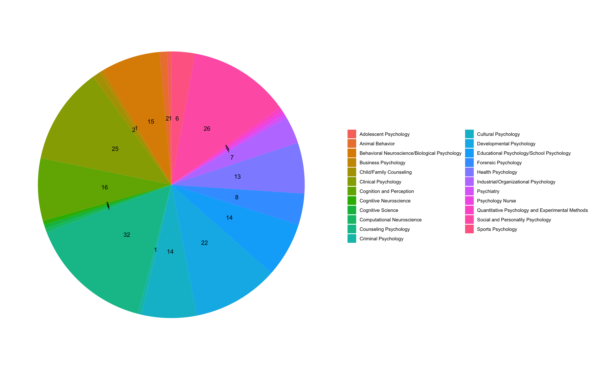

---
title: "PUMP RA Interview Statistics"
output: html_document
---

```{r loading_packages, echo = FALSE, include = FALSE}
library("dplyr")
library("wordcloud")
library("tidytext")
library("ggplot2")
library("RColorBrewer")
library("stringr")
```
#### Hannah Nguyen
<br>

```{r, echo = FALSE, warning = FALSE, message = FALSE, code = readLines("summary.R")}
```


### Sample Dataset #1: Prospective Participants  
<br>

#### Quantitative Data: 

Total number of undergraduates participating: **`r undergraduates`**   
<br>

*Breakdown of undergraduate mentees:*   
```{r, echo = FALSE, warning = FALSE, message = FALSE, code = readLines("mentee-breakdown.R")}
```
<br>

*Breakdown of mentors:*    
```{r, echo = FALSE, warning = FALSE, message = FALSE, code = readLines("mentor-breakdown.R")}
```
<br>

##### Gender Identity Percentages:
Male mentees: **`r male_percentage`%**  
Female mentees: **`r female_percentage`%**  
Non-binary mentees: **`r non_binary_percentage`%**  

##### Ethnic/Race Percentages:  
Amount of *African American* mentees: **`r aa_percentage`%**  
Amount of *East Asian* mentees:  **`r ea_percentage`%**  
Amount of *Filipino* mentees:  **`r filipino_percentage`%**  
Amount of *Latinx* mentees:  **`r lx_percentage`%**  
Amount of *Middle Eastern* mentees:  **`r me_percentage`%**  
Amount of *South Asian* mentees:  **`r sa_percentage`%**  
Amount of *South East Asian* mentees:  **`r sea_percentage`%**  
Amount of *White* mentees:  **`r white_percentage`%**  

##### Additional Percentages of Underrepresented Identities:  
Queer mentees:  **`r queer_percentage`%**  
First-generation college students:  **`r fgcs_percentage`%**  
<br>
<br>

##### Visualization of Areas of Interest of Mentees:
 

#### Qualitative Data:  
Themes in the response *“What is your primary reason for seeking a psychology mentor?”*  
```{r, echo = FALSE, warning = FALSE, message = FALSE, code = readLines("wordcloud1.R")}
```

### Sample Dataset #2: Current Participant Survey
<br>

#### Quantitative Data:  

Mentees who are interested in continuing with the same mentor: **`r same_mentor`**  
Mentees who are maybe interested in continuing with the same mentor: **`r maybe_same_mentor`**  
Mentees who need to be rematched with a new mentor: **`r rematch_mentor`**  
Mentees who maybe need to be rematched with a new mentor: **`r maybe_rematch_mentor`**  
Mentees who want to become a mentor next year: **`r possible_mentor`**  
<br>


*“How has your mentoring relationship impacted your feelings of belonging in the UW Department of Psychology?”*  
```{r, echo = FALSE, warning = FALSE, message = FALSE, code = readLines("chart2.R")}
```
<br>
<br>  

#### Qualitative Data:  
Themes in responses to the following two questions:  
*“People can seek mentorship relationship for a variety of reasons... What's your reason for participating in this program?”*  
```{r, echo = FALSE, warning = FALSE, message = FALSE, code = readLines("wordcloud2.R")}
```

<br>
*"What have you learned from your mentor?”*  
```{r, echo = FALSE, warning = FALSE, message = FALSE, code = readLines("wordcloud3.R")}
```